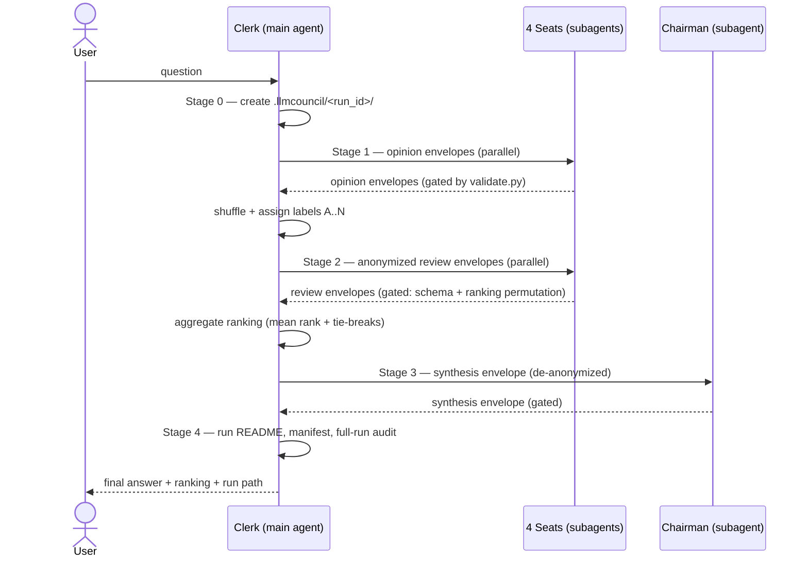

# llmcouncil

A skill that replicates the end-to-end flow of
[karpathy/llm-council](https://github.com/karpathy/llm-council) — first
opinions → anonymized peer review → chairman synthesis — using a **single LLM
provider** and **custom subagents** instead of multiple providers behind
OpenRouter.

## How this maps to the original

| llm-council (original) | llmcouncil (this skill) |
|---|---|
| 4 models from 4 providers via OpenRouter | 4 persona subagents ("seats") on one provider/model |
| FastAPI backend orchestrates stages | The main agent orchestrates as the **Clerk** |
| Stage 1: parallel HTTP calls to council models | Stage 1: parallel subagent dispatch with `opinion` envelopes |
| Stage 2: anonymized "Response A/B/C…" + regex-parsed `FINAL RANKING:` | Stage 2: anonymized labels + schema-validated `review` envelopes (no regex) |
| Aggregate ranking = average position | Same, plus deterministic tie-breaks (1st-place votes, then label) |
| Stage 3: chairman model synthesizes | Stage 3: `council-chairman` subagent synthesizes |
| Failed models silently dropped | Failed seats dropped after 1 validated retry, recorded in the manifest |
| Title generation for the conversation | Run slug in `run_id` (Clerk metadata) |
| Storage: one JSON conversation file | Structured run directory with README + manifest + raw envelopes |
| React frontend tab view | Human-readable markdown files per stage |

## The flow



Every arrow between Clerk and subagents is a versioned JSON envelope
(`llmcouncil/v1`) defined in `references/protocol.md`, normatively specified
in `schemas/`, and machine-checked by `scripts/validate.py`. That is the
communication standard: same request shape going out, same response shape
coming back, for every seat, every stage, every run.

## Skill layout

```
llmcouncil/
├── SKILL.md                  # the Clerk's playbook (orchestration protocol)
├── README.md                 # this file
├── agents/                   # CANONICAL seat definitions (runtime-neutral)
│   ├── _protocol.md          # shared member contract (stages, envelopes)
│   ├── analyst.md …          # stance + metadata per seat
│   └── chairman.md           # chairman contract (stage 3 only)
├── adapters/                 # GENERATED per-runtime agent files (never edit)
│   ├── claude/               # Claude Code (.md) + install.md
│   ├── opencode/             # OpenCode  (.md) + install.md
│   ├── codex/                # Codex CLI (.toml) + install.md
│   └── kimi/                 # Kimi Code (.md) + install.md
├── references/
│   ├── protocol.md           # envelopes, retry format, dispatch notes
│   ├── output-structure.md   # run directory layout + manifest spec
│   └── evaluation.md         # rubric, aggregate algorithm, error codes
├── schemas/                  # normative JSON Schemas (opinion/review/synthesis/manifest)
├── scripts/
│   ├── validate.py           # stdlib-only envelope gate + run auditor
│   └── generate_adapters.py  # agents/ → adapters/; --check detects drift
└── assets/                   # templates for every run artifact
```

**Architecture rule:** `agents/` is the semantic source; `adapters/` is a
mechanical projection of that source for each runtime. Generated files are
fully self-contained (no second lookup at runtime) and committed so
installation is a plain `cp`.

## The seats

| Seat | Stance |
|---|---|
| `council-analyst` | First-principles decomposition, definitions, quantified rigor |
| `council-skeptic` | Adversarial stress-testing, hidden assumptions, failure modes |
| `council-pragmatist` | Actionability, constraints, costs, real-world tradeoffs |
| `council-explorer` | Reframing, non-obvious alternatives, second-order effects |
| `council-chairman` | Synthesis only — consensus, disputes, dissent |

All seats inherit the session's provider and model; diversity is enforced by
stance, not by weights. Seats are functionally symmetric (every member both
answers and reviews — that symmetry is what makes the peer ranking
meaningful); only their stances differ. Every adapter is generated from the
same canonical definition in `agents/` — only the runtime wrapper differs.

## Installing the seats

The seat subagents must be registered in your harness once. Skill installers
(`skillshare`, `npx skills add`, manual copy) install the *skill* but do not
register *agents* — those are separate discovery mechanisms. You have two
ways to close that gap, and the skill works either way (it falls back to
general-purpose subagents + the bundled seat prompts when seats are missing;
installed seats are cleaner and cheaper):

1. **Let the skill do it** — on first run, if the seats are not registered,
   the Clerk offers to copy the right adapters into your harness's agents
   directory (project- or user-level, with your explicit confirmation).
2. **Manual copy** — one `cp` per runtime, below.

**Claude Code** (project-level; use `~/.claude/agents/` for user-level):

```bash
cp llmcouncil/adapters/claude/council-*.md .claude/agents/
```

**OpenCode** (project-level; use `~/.config/opencode/agents/` for global):

```bash
cp llmcouncil/adapters/opencode/council-*.md .opencode/agents/
```

**Codex CLI** (project-level; use `~/.codex/agents/` for personal):

```bash
cp llmcouncil/adapters/codex/council-*.toml .codex/agents/
```

**Kimi Code CLI** (project-level; use `~/.kimi-code/agents/` for user-level):

```bash
cp llmcouncil/adapters/kimi/council-*.md .kimi-code/agents/
```

Details and verification steps per runtime: `adapters/<runtime>/install.md`.

## Using it

Ask the agent, e.g.:

> Convene the council: should we migrate this service from REST to gRPC?

The run lands in `.llmcouncil/<YYYYMMDD-HHMMSS>-<slug>/`. Start with that
directory's `README.md` — it explains the reading order (final answer first,
then rankings, then individual opinions and reviews).

## Validating outputs

Every subagent reply is gated at exchange time, and the whole run is audited
at close:

```bash
# one envelope
python3 llmcouncil/scripts/validate.py envelope --stage review \
    .llmcouncil/<run>/envelopes/review-council-skeptic.json

# a complete run
python3 llmcouncil/scripts/validate.py run .llmcouncil/<run>/
```

Exit `0` means standard-conformant. Findings carry stable error codes
(`E-ENV-*`, `E-REV-*`, `E-RUN-*`, `W-RUN-*`) documented in
`references/evaluation.md`.

## Regenerating adapters

`adapters/` is derived from `agents/`. After any change to `agents/`:

```bash
python3 llmcouncil/scripts/generate_adapters.py          # regenerate
python3 llmcouncil/scripts/generate_adapters.py --check  # CI / drift audit
```

`--check` exits 1 if any adapter is missing, hand-edited, or stale, so a CI
job (or a pre-commit hook) can enforce that nobody edits generated files.

## Extending

To add a seat: create one canonical file `agents/<stance>.md` (frontmatter:
`name`, `title`, `role: member`, `description`, `tools`; body: the stance
bullets only), run `generate_adapters.py`, install the new adapter files,
and add the seat to the roster tables in `SKILL.md` and `assets/question.md`.
Keep seats functionally symmetric — every member answers AND reviews; a seat
that only answers or only reviews breaks the peer ranking. The protocol,
schemas, and validator are seat-count agnostic (labels run `A`..`N`, quorum
stays 2).

To support a new runtime: add a renderer to `scripts/generate_adapters.py`
(~15 lines), a `adapters/<runtime>/install.md`, and regenerate.

## Credits

Flow and stage design from
[karpathy/llm-council](https://github.com/karpathy/llm-council) (MIT-spirited
"vibe coded" original). This skill re-implements the flow for agent harnesses
with a machine-checked communication standard and structured, self-describing
run artifacts.
