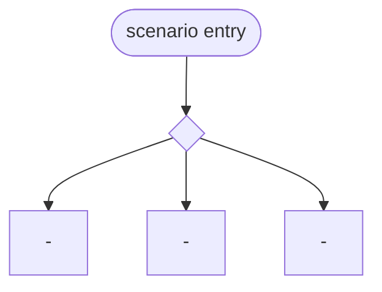

<!--
traceflow diagram-composite template.

This file is a scenario-level rollup inside `domain/<area>/diagrams/`,
typically named `00-<scenario>.md` or `00-system-context.md`.

A COMPOSITE diagram is an INDEX VIEW. It names which behavior
diagrams compose a scenario. It carries NO sequence detail of its
own. Its only first-class content is references to behavior diagrams
(and through them, indirectly, to fragments).

Hard rules for composite diagrams:
- MUST NOT redraw sequence steps. If you want to show steps, you are
  authoring a behavior diagram, not a composite.
- MUST reference behavior diagrams by file id (`<NN>-<slug>.md`) and
  optional behavior anchor (`§<heading-slug>`).
- MAY contain a high-level flowchart that names behaviors as nodes —
  but each node MUST link to the behavior file. The flowchart is
  navigation, not specification.
- MUST NOT consume fragments directly. Fragments are consumed by
  behavior diagrams; composites consume behaviors.

Required headings (parsed by invariants):
- `## Scenario`
- `## Behaviors`
- `## Cross-reference`
-->

# <NN> — <scenario name>

## Scenario

<!--
One paragraph: what business scenario this composite rolls up.
Cite the canonical scenario file or section. Do NOT restate
behavior detail — that belongs in the behavior diagrams.
-->

<scenario-prose>

## Behaviors

<!--
The ordered (or unordered) set of behavior diagrams that compose
this scenario. Each row names the behavior diagram, optionally an
anchor inside it, and a one-line trigger condition.

Group by branch when the scenario has a decision split (e.g. parent
PDP classifies as leaf | multi-variation | unavailable | parse
failure).
-->

| Behavior | Trigger | Notes |
|---|---|---|
| `<NN>-<slug>.md` | <when does this branch fire> | <optional one-line> |
| `<NN>-<slug>.md` §<heading-slug> | <when> | <optional> |

## Navigation flowchart (optional)

<!--
A flowchart whose NODES are behavior names and EDGES are decision
predicates. NO sequence steps. Used purely for navigation.

Each node should link by Mermaid click directive when the renderer
supports it; otherwise the table above is authoritative.
-->

## Cross-reference

- Scenario: <scenario-id>
- Behaviors: see table above
- Decisions: <ADR-NNN> (composite-defining ADR, if any)
