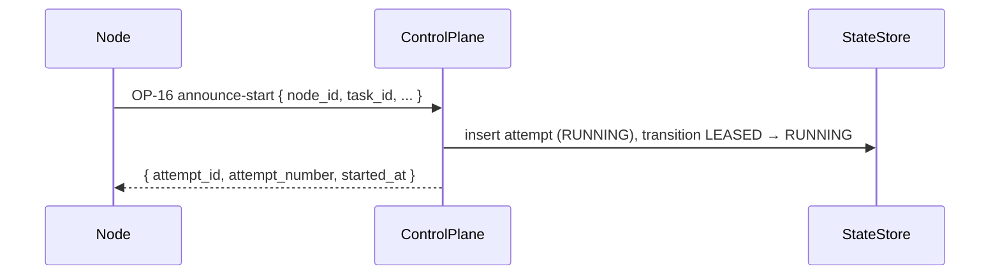
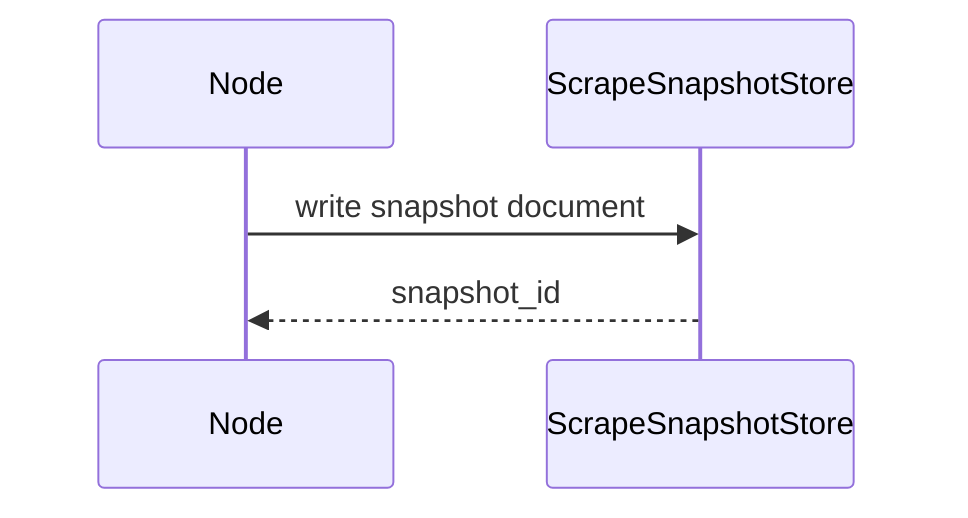
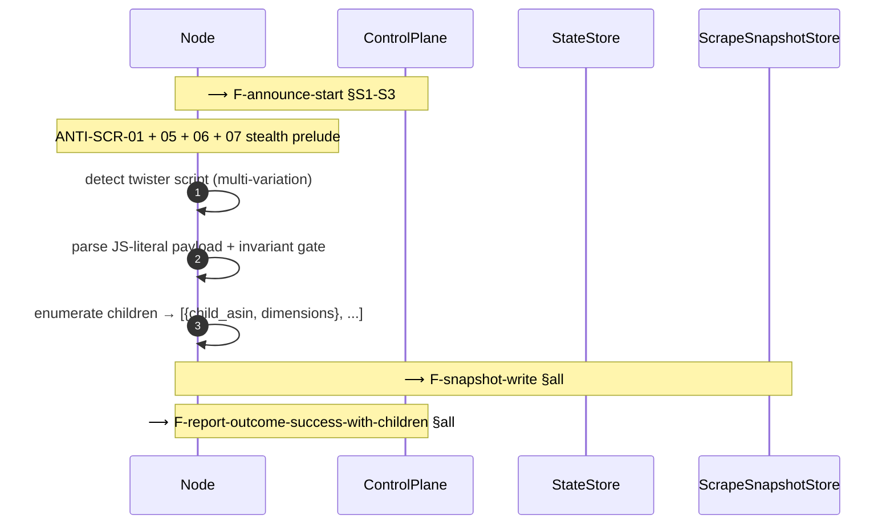
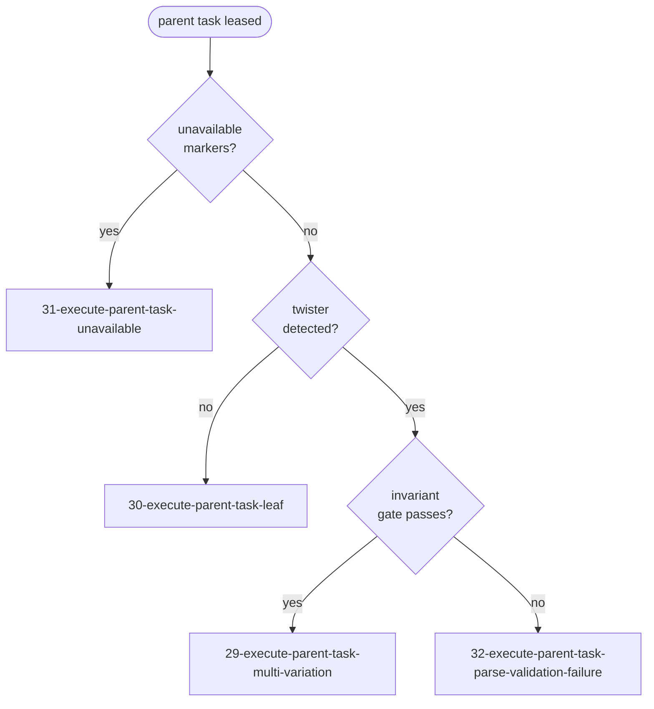

# Behavior-scoped diagrams

Diagrams are a sub-type of the `domain` axis. They visualize
problem-space behavior, not implementation. They inherit domain's
hard rules: per-area isolation, no duplicated rules, append-mostly.

This file is the canonical reference for the diagram convention
described in `SKILL.md` under "Diagrams (sub-type of domain)". Read
it when you need detail beyond the protocol summary.

---

## 1. Three classes

| Class | Purpose | Owns | References |
|---|---|---|---|
| **Fragment** | A reusable sub-sequence: an envelope, a handshake, a sub-transaction | 1 named fragment | nothing |
| **Behavior** | One decision branch / outcome / variant — only the slice unique to *this* behavior | nothing | 0..N fragments |
| **Composite** | Index-level rollup naming which behaviors compose into a scenario; no sequence detail | nothing | only behavior diagrams |

### What goes where

| If the sub-sequence is... | It belongs as a... |
|---|---|
| An ADR-defined wire contract or operation envelope (e.g. `OP-16`) | **Fragment**, anchored by the ADR |
| Identical (modulo participant aliases) across ≥2 behavior diagrams | **Fragment** |
| Single-use, even if it looks reusable on paper | Inline in the behavior diagram. Do not pre-fragment. |
| A rule chain referenced by ID in prose (e.g. `ANTI-SCR-01 + 05 + 06 + 07`) | A *named note*, NOT a fragment. Domain rules already own the IDs. |
| The decision branch itself (the unique slice) | **Behavior** |
| A roll-up of multiple behaviors under one business scenario | **Composite** |

---

## 2. File layout

```
domain/<area>/diagrams/
├── README.md
├── 99-index.md
├── _fragments/
│   ├── F-<slug>.md
│   └── F-<slug>.md
├── 00-<composite>.md          # composite (optional)
├── <NN>-<behavior-slug>.md    # behavior
└── <NN>-<behavior-slug>.md    # behavior
```

Cross-area fragments live under:

```
domain/_shared/diagrams/_fragments/
└── F-<slug>.md
```

`_fragments/` mirrors the role of `_shared/` for ADRs: visually
distinct, opt-in consumption. The `F-` prefix on filenames keeps
fragment files visually distinguishable from behavior files when
listed.

---

## 3. Anchor syntax

Every diagram has mandatory `## Steps` with numbered subheadings
(`### S1. <label>`). Behavior diagrams reference fragments via two
surfaces, both required when a fragment is consumed:

### 3.1 In-diagram splice marker

Inside the Mermaid block:

```
Note over <Alias1>,<Alias2>: ⟶ F-<slug> §S1-S3
```

The `⟶ ` prefix is mandatory. `scripts/invariants.sh` parses it to
extract anchors. The note may carry additional prose after the
anchor, separated by `<br/>`:

```
Note over N,CP: ⟶ F-announce-start §S1-S3<br/>attempt registered + RUNNING
```

### 3.2 `## Fragments used` block

The diagram-axis analog of spec `Owns:`. Every consumed fragment is
declared here with its step range and one-line role.

```markdown
## Fragments used

- F-announce-start §S1-S3 — attempt registration
- F-report-outcome-success §all — terminal SUCCESS envelope
- _shared/F-anti-detection-prelude §S1-S4 — pre-scrape stealth dance
```

Anchor format:

- `F-<slug> §S<N>`             single step
- `F-<slug> §S<N>-S<M>`        range
- `F-<slug> §all`              entire fragment
- `_shared/F-<slug> §...`      cross-area fragment

When a behavior has no reusable sub-sequences, the block is **not**
omitted. It declares one typed `none` entry:

```markdown
## Fragments used

- none: standalone   the behavior has no sub-sequences shared with
                    other diagrams
```

Allowed `none` classes:

| Class | When to use |
|---|---|
| `none: standalone` | Behavior is genuinely single-use and has no reusable surface. |
| `none: speculative` | A future fragment is anticipated but the promotion bar (≥2 consumers or ADR-anchored) is not yet met. |

---

## 4. Promotion bar (when a sub-sequence becomes a fragment)

A sub-sequence is promoted to a fragment only when at least one is
true:

1. **Empirical reuse:** referenced by ≥2 behavior diagrams.
2. **ADR-anchored contract surface:** the sub-sequence corresponds to
   a named contract surface in an accepted ADR (e.g. an `OP-*`
   envelope, a transactional template).

Do NOT promote:

- Sub-sequences referenced by exactly one behavior diagram and
  lacking an ADR anchor. Inline them. Promote later when a second
  consumer appears.
- Rule chains (`ANTI-*`, `BIZ-*`, `INV-*`). These already have IDs
  and live in domain rule files. They are referenced by *prose* in
  diagram notes, not redrawn anywhere.

---

## 5. Canonical-owner rule

A fragment ID exists in exactly **one** file: its canonical owner
under `_fragments/`. Any behavior diagram that would otherwise
redraw it MUST consume by anchor instead.

This is the diagram-axis analog of the spec `Owns:` exclusivity
rule. Invariant 8 enforces it.

When two behaviors evolve and a fragment's body must change:

- The change is a structural edit to a domain artifact.
- It MUST be recorded as a spec-delta in the active spec's `plan.md`:
  ```
  - MODIFIED domain/<area>/diagrams/_fragments/F-<slug>.md#<heading>: <what changes, why>
  ```
- Every behavior diagram listed in the fragment's `## Consumers`
  block SHOULD be re-read to verify the change doesn't break the
  behavior's narrative.

---

## 6. Decomposition recipe

You have an end-to-end diagram that mixes generic handshakes with
behavior-specific logic. Decompose like this:

### Step 1: identify candidate fragments

Read the diagram top-to-bottom. Mark each sub-sequence as one of:

- **C** (contract surface) — corresponds to an ADR-anchored operation
  or schema. Always a fragment candidate.
- **R** (repeated) — appears in other diagrams you've already seen
  with the same shape. Fragment candidate.
- **U** (unique) — the part of the diagram that is genuinely
  this-behavior-only. Stays inline.
- **N** (note) — a rule chain or annotation already owned by an ID
  elsewhere (e.g. an `ANTI-SCR-*` rule). Becomes a one-line note,
  not a fragment.

### Step 2: apply the promotion bar

For each **C** and **R**, check the promotion bar:

- **C** automatically qualifies (ADR-anchored).
- **R** needs ≥2 consumers. If you have not yet drafted the other
  consumers, defer promotion and mark `none: speculative` in the
  current behavior.

### Step 3: write the fragments

For each promoted sub-sequence:

- Create `_fragments/F-<slug>.md` from `assets/diagram-fragment.md`.
- Lift the canonical body verbatim.
- Number steps `### S1.`, `### S2.`, …
- If ADR-anchored, fill the `## Anchored by` section.

### Step 4: slim the behavior diagram

- Replace each lifted sub-sequence with a Mermaid splice marker:
  ```
  Note over <Alias1>,<Alias2>: ⟶ F-<slug> §S1-S3
  ```
- Add a `## Fragments used` block at the bottom listing the
  consumed fragments.
- Renumber the behavior's `## Steps` to cover only the inline
  (unique) steps.

### Step 5: update the index and consumer lists

- Append rows to `99-index.md` for the new fragments.
- Update the `## Consumers` block on each fragment to list the
  behavior(s) that consume it.
- Re-run `bash scripts/invariants.sh --invariant 7` and 8 to verify.

### Step 6: record the deltas

The decomposition is a domain edit. The spec that performs it
records its impact in `plan.md`:

```markdown
- ADDED domain/<area>/diagrams/_fragments/F-announce-start.md: ratifies the OP-16 envelope per ADR-NNN
- MODIFIED domain/<area>/diagrams/08-execute-task-success.md#diagram: slimmed to behavior-only; consumes F-announce-start §S1-S3
- MODIFIED domain/<area>/diagrams/29-execute-parent-task-multi-variation.md#diagram: slimmed to behavior-only; consumes F-announce-start §S1-S3, F-report-outcome-success §all
```

---

## 7. Worked example

### Before: end-to-end diagram (fictitious flow 29-style)

```mermaid
sequenceDiagram
    autonumber
    participant N as Node
    participant CP as ControlPlane
    participant SS as StateStore
    participant Snap as ScrapeSnapshotStore

    N->>CP: OP-16 announce-start { node_id, task_id, ... }
    CP->>SS: insert attempt (RUNNING), transition LEASED → RUNNING
    CP-->>N: { attempt_id, attempt_number, started_at }

    N->>N: ANTI-SCR-01 + 05 + 06 + 07 stealth prelude

    N->>N: detect twister script (multi-variation)
    N->>N: parse JS-literal payload + invariant gate
    N->>N: enumerate children
    N->>Snap: write parent snapshot
    Snap-->>N: snapshot_id

    N->>CP: OP-17 report-outcome { outcome=success, snapshot_reference, children: [...] }
    CP->>SS: BEGIN; finalize attempt; bulk insert child tasks; COMMIT
    CP-->>N: { task_id, final_status=SUCCESS, accepted }
```

### Classification

| Sub-sequence | Class | Reason |
|---|---|---|
| OP-16 announce-start + RUNNING transition | **C** | ADR-anchored (OP-16 envelope). Used by flows 08, 09, 10, 29, 30, 31, 32, 33, 34. |
| Anti-detection prelude (ANTI-SCR-01 + 05 + 06 + 07) | **N** | Rule IDs already exist. Becomes a one-line note. |
| Detect twister + parse + invariant gate + enumerate children | **U** | The unique slice. Stays inline. |
| Snapshot write | **R** | Used by every success-path scrape behavior. Fragment candidate. |
| OP-17 report-outcome + transactional finalize + child seed | **C** | ADR-anchored (OP-17 + ADR-029 transactional seed). |

### After: behavior diagram + three fragments

`_fragments/F-announce-start.md`:



Steps:

```
### S1. emit announce-start
### S2. insert attempt + transition LEASED → RUNNING
### S3. return attempt context
```

`_fragments/F-report-outcome-success-with-children.md`:

```mermaid
sequenceDiagram
    participant N as Node
    participant CP as ControlPlane
    participant SS as StateStore

    N->>CP: OP-17 report-outcome { outcome=success, snapshot_reference, children: [...] }
    CP->>SS: BEGIN; finalize attempt; bulk insert child tasks; COMMIT
    CP-->>N: { task_id, final_status=SUCCESS, accepted }
```

`_fragments/F-snapshot-write.md`:



Behavior diagram `29-execute-parent-task-multi-variation.md` now looks
like:



With this `## Fragments used` block:

```markdown
## Fragments used

- F-announce-start §S1-S3 — attempt registration before navigation
- F-snapshot-write §all — parent snapshot persisted under shared store
- F-report-outcome-success-with-children §all — terminal SUCCESS + transactional child seed
```

The behavior diagram now reads as "the unique multi-variation parts"
with explicit pointers to where the generic envelopes live. Reading
the file in isolation is enough to understand the multi-variation
branch; readers who want the envelope detail follow the anchors.

---

## 8. Composite example

A composite for the parent-task scenario:

```markdown
# 00 — Parent task scenario (composite)

## Scenario

A worker leases a task with `is_parent = true, parent_asin = null`.
The branch fires on what the PDP HTML carries. This composite names
the four behavior diagrams that cover every outcome.

## Behaviors

| Behavior | Trigger | Notes |
|---|---|---|
| `29-execute-parent-task-multi-variation.md` | Twister script present, invariant gate passes | Seeds N child tasks |
| `30-execute-parent-task-leaf.md` | No twister script | Parent IS the consumer-payload producer |
| `31-execute-parent-task-unavailable.md` | BIZ-59 unavailable markers present | Zero-stock snapshot, zero children |
| `32-execute-parent-task-parse-validation-failure.md` | Twister present, invariant gate fails | gzipped HTML to error store, requeue per ADR-024 |

## Navigation flowchart


```

No sequence steps in the composite. Pure navigation.

---

## 9. Invariants

`scripts/invariants.sh` enforces:

7. Every `F-<slug> §<range>` reference resolves to a real heading in
   the canonical fragment file.
8. Each fragment ID exists in exactly one file (single canonical
   owner).
9. Cross-area fragment refs only resolve under
   `domain/_shared/diagrams/_fragments/`.
10. Every behavior diagram has a `## Fragments used` block (may be
    `- none: <typed-class>`).

Failures are reported, not silently fixed. Same as every other
invariant in the suite.
