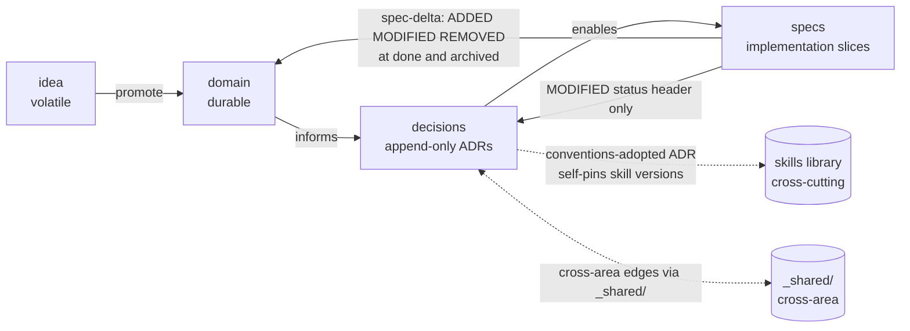

# traceflow lifecycle

Full state machines, artifact topology, and the three legal authoring paths.
This file is the canonical reference for `SKILL.md`. Read it when you need
detail beyond the protocol summary.

---

## 1. Artifact topology (not a pipeline)

The four axes are an **artifact topology with directed dependency edges**,
not a temporal sequence. A spec can legitimately discover a missing rule
that requires backward edits to domain and a new ADR.



Default edge direction: left to right. Backward edges (spec → domain,
spec → ADR) exist and are legal, but ONLY through the spec-delta
mechanism. Editing domain or ADRs in the same commit as spec code
without recording a delta is a process bug.

---

## 2. The three legal paths

### 2.1 Standard path

```
/traceflow:idea  →  /traceflow:domain  →  /traceflow:adr  →  /traceflow:spec
                                                                ↓
                                                            ready → in-progress → done → archived
```

Use when: the work is anticipated, scoped, and not under emergency
pressure. Default for any feature, capability, or refactor that the
team has time to plan.

Skip-allowed: a standard spec MAY skip `/traceflow:idea` if the work
is fully scoped already, MAY skip `/traceflow:adr` if no new
architectural decision is required.

### 2.2 Hotfix path

```
/traceflow:spec --hotfix  →  in-progress  →  done
                                              ↓
                                  retroactive resolution of deltas
                                  retroactive ADRs if applicable
                                              ↓
                                          archived
```

Use when: production is broken, regulatory deadline, or any work where
delay is itself a failure. The hotfix path lets a spec go straight
from creation to `in-progress` without a `ready` gate.

Required:
- `brief.md` filled before any code.
- `plan.md` may declare `NONE: hotfix` in the deltas section initially.
- Before `archived`: deltas MUST be resolved (every `NONE: hotfix` either replaced with real ADDED/MODIFIED entries OR re-justified with a different typed NONE).
- A `_shared/incidents/` log entry SHOULD be appended if this hotfix relates to a postmortem-eligible event. (Not required by the skill; recommended by `references/examples.md`.)

### 2.3 Spike path

```
/traceflow:idea  →  /traceflow:spec --spike  →  in-progress  →  closed: spike
                                                                     ↓
                                                              findings lift to ideas
                                                                  or decisions
                                                                     ↓
                                                                 archived
```

Use when: a question can only be answered by writing code. Spikes are
exploratory; they do not ship to production.

Required:
- `brief.md` MUST state the research question.
- `plan.md` deltas section MUST be `NONE: spike <free-text>`.
- Terminal state is `closed: spike` (NOT `done`). Followed by `archived`.
- Findings MUST be lifted: either to a new idea folder (if more exploration needed), to new ADRs (if a decision was reached), or to a follow-up spec (if implementation is now scoped).

---

## 3. Per-axis state machines

### 3.1 Idea

```
[*] --> iterating: create folder
iterating --> iterating: edit prose, append to transcript.md
iterating --> promoted: content lifted to domain
iterating --> abandoned: discard
promoted  --> [*]: folder deleted, area STATUS logs
abandoned --> [*]: folder deleted, area STATUS logs
```

Folder existence IS the state. No `proposed → ready` ceremony.

### 3.2 ADR

```
[*] --> proposed: draft
proposed --> accepted: review pass, INDEX row added
proposed --> [*]: rejected, file deleted
accepted --> superseded: ADR-MMM supersedes; both link
accepted --> deprecated: no replacement
```

Body NEVER edited after acceptance. Only the Status header changes
on supersede or deprecate. Numbers globally unique across `_shared/`
and every per-area bucket.

### 3.3 Spec

```
[*] --> draft: /traceflow:spec scaffolds four files
draft --> ready: review pass + delta syntax + scoping
draft --> in_progress: hotfix or solo workflow skips ready
ready --> in_progress: contributor starts
ready --> closed: cancelled before start
in_progress --> done: deltas applied, tests pass, ACs met
in_progress --> closed: cancelled mid-work
done --> closed: superseded by a later spec
done --> archived: re-verify, git mv to archive/
closed --> archived: git mv to archive/
```

`ready` is optional; solo workflows may go `draft → in_progress`
directly. `closed` requires a `reason:` field. Six states total.

---

## 4. Stage-to-Updates table

This table is the authoritative answer to "what does the agent update
at each transition?" The Update Manifest in SKILL.md is the
end-of-turn report; this table is the input to that report.

| Stage / event | Files the agent MUST update |
|---|---|
| Idea created | `ideas/<area>/<topic>/README.md`, `ideas/<area>/<topic>/transcript.md` |
| Idea iterated | append to `transcript.md` after each exchange; edit `README.md` as prose stabilizes |
| Idea promoted | one or more files under `domain/<area>/`; `specs/<area>/STATUS.md` (Ideas promoted log); `domain/glossary.md` if new terms; `domain/MAP.md` ONLY if a new area emerges; if the promoted content describes a behavior or flow, derive consequent diagram updates under `domain/<area>/diagrams/` in the same operation; idea folder deleted |
| Idea abandoned | `specs/<area>/STATUS.md` (Ideas abandoned log, one line); idea folder deleted |
| ADR proposed | `decisions/<area>/ADR-NNN-<slug>.md` (frontmatter `status: proposed`) |
| ADR accepted | ADR file (`status: accepted`); `decisions/<area>/INDEX.md` (append row with `ADR-NNN | type | summary | accepted`); if the ADR has behavioral impact, derive consequent diagram updates under `domain/<area>/diagrams/` in the same operation and log under "Domain edits triggered by ADR-NNN" in `specs/<area>/STATUS.md` |
| ADR superseded | superseded ADR's Status header ONLY (no body edit); superseding ADR's body references it; both INDEX rows updated |
| ADR deprecated | ADR's Status header ONLY; INDEX row updated |
| Spec drafted | `specs/<area>/S0NN-<slug>/{brief, plan, tasks, status}.md`; `specs/<area>/STATUS.md` (append row) |
| Spec `draft → ready` | `specs/<area>/S0NN/status.md`; `specs/<area>/STATUS.md`; deltas syntax + scoping verified |
| Spec `ready → in_progress` | `specs/<area>/S0NN/status.md`; `specs/<area>/STATUS.md`; `STATUS.md` (global) |
| Spec `in_progress → done` | `specs/<area>/S0NN/status.md`; `specs/<area>/STATUS.md`; `STATUS.md` (global); deltas APPLIED to `domain/<area>/` (per ADDED/MODIFIED/REMOVED rows); ADR Status headers if MODIFIED-against-ADR rows exist; `specs/<area>/MAP.md` rebuilt from Owns blocks |
| Spec `→ closed` | `specs/<area>/S0NN/status.md` with `reason:` and free-text; `specs/<area>/STATUS.md`; `STATUS.md` |
| Spec `→ archived` | `git mv specs/<area>/S0NN specs/<area>/archive/S0NN`; all three STATUS files; `specs/<area>/MAP.md` (move spec to Historical section) |
| New area promoted | `domain/MAP.md` (new row + dependency edges); `domain/<area>/README.md` scaffolded; `decisions/<area>/INDEX.md` scaffolded; `specs/<area>/STATUS.md` scaffolded; `specs/<area>/MAP.md` scaffolded; `STATUS.md` (global, new row); promotion ADR added in `decisions/_shared/` |

STATUS rows are append-only. MAP rows allow in-place edits when ownership transfers.

### Direct domain edits and tooling maintenance (no spec wrapper, no ADR)

Some changes touch only `domain/<area>/` content or only the
tooling layer. These are NOT decisions and do NOT warrant a spec or
an ADR.

**Direct domain edits.** Content under `domain/<area>/` (including
any diagram under `domain/<area>/diagrams/`) changes without an
accompanying code change. Examples:

- A diagram refactor derived from accepting an ADR that ratified a
  new behavior.
- A diagram update derived from a domain edit that defined a new
  rule or entity.
- A clarifying rewrite of a domain file with no behavioral change.

**Tooling maintenance.** A vendored skill script or asset is
re-synced from upstream (routine pickups of new skill versions,
including draft / pre-release). Repo-local deltas are re-applied
per their headers. Examples:

- `scripts/invariants.sh` re-vendored from a newer traceflow draft.
- A skill template under `assets/` re-synced after a fix upstream.

Both kinds MUST be logged in `specs/<area>/STATUS.md` (under
`## Recent activity` or a similar maintenance log) naming the
trigger or the version delta. The commit message names the files;
the STATUS log gives the audit trail. No `plan.md`/`tasks.md`/
`status.md` artifacts are created. No `conventions-adopted` ADR is
opened — see `SKILL.md §Versioning and self-pinning` for the rules
on when a skill change DOES warrant a new ADR (deliberate version
pin, breaking change requiring migration, skill substitution,
material repo-local-delta change).

If the same edit also touches code outside `domain/<area>/`, it is
NOT a direct domain edit — it is part of a spec, and the diagram
changes ride on the spec's `## Domain impact` deltas.

---

## 5. Per-area boundary

A spec in area A cannot transition `done` based on tests, ACs, or
domain content from area B. Each area's lifecycle is self-contained.
Cross-area coordination happens through `_shared/` ADRs only.

Forbidden:
- A spec in `specs/A/` declares `Owns:` paths starting with `B/` or `services/<B-service>/`.
- A delta entry in `specs/A/S0NN/plan.md` targets `domain/B/...`.
- An ADR in `decisions/A/` references ADRs in `decisions/B/` directly. Use `_shared/` for the shared decision instead.

Legal cross-area edges:
- An ADR in `_shared/` references area-A and area-B ADRs as informing context.
- A spec in `specs/A/` declares a delta against `_shared/<file>` (e.g. a shared contract).
- A change in domain that affects multiple areas is captured as ADRs in `_shared/` and reflected in each area's domain via separate specs.

---

## 6. Promotion criteria

### 6.1 Idea → domain

Promote when at least one is true:

- The content has been stable for two or more iterations.
- It has been validated against a concrete scenario or example.
- A downstream artifact (an ADR or a spec) needs to reference it.

Do NOT promote:
- Open questions. Those stay in `transcript.md` until answered.
- Speculation labeled as such.
- Tech notes (those become ADRs of type `stack` or `structure`).

### 6.2 Single-area repo → multi-area

A new area gets its own subfolder under `domain/<area>/`, `decisions/<area>/`,
`ideas/<area>/`, `specs/<area>/` when at least one is true:

- More than one rules-equivalent file is needed (rules diverge in topic).
- Three or more strongly related entities exist that no other area touches.
- A separate state-machine surface exists (different lifecycles).
- A distinct anti-pattern or constraint set applies (e.g. anti-detection rules for a scraping system, encryption rules for an auth system).

Promotion is registered in `domain/MAP.md` and accompanied by an ADR
in `decisions/_shared/` of type `structure` recording the boundary
choice.

---

## 7. Single-area mode

For repositories with exactly one area, KEEP the `<area>/` folder.
See `references/single-area-collapse.md` for what the minimum-viable
layout looks like. The folder level is NOT flattened. This is
deliberate: future growth to multiple areas does not refactor the
tree.

---

## 8. Drift and recovery

When invariants fail (per `scripts/invariants.sh`), the agent
SHOULD:

1. Stop. Do not auto-fix.
2. Report the failure with file paths in the Update Manifest.
3. Open a `closed: refactor` follow-up spec to record the corrective
   work, or treat it as a hotfix per the hotfix path above.

Silent fixes are forbidden. Documentation drift is itself information.
